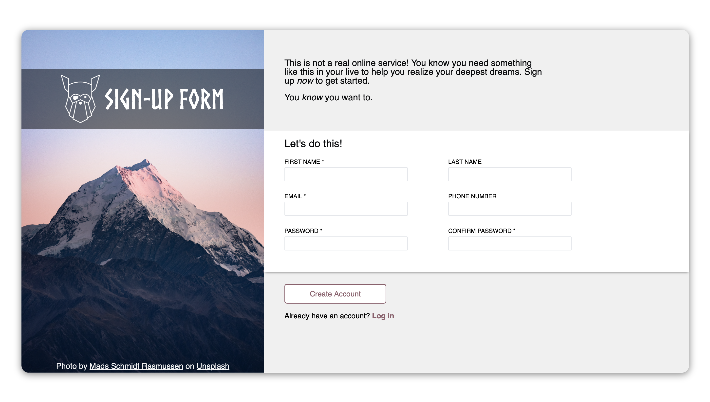
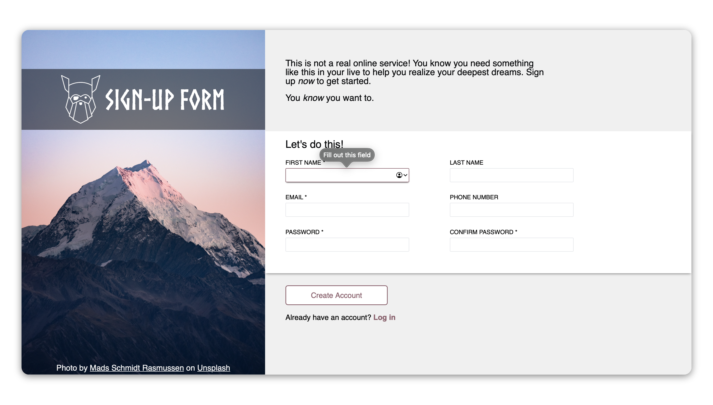

# Sign-up Form

Well, this was a fun one. This was the `sign-up form`, the [*6th project*](https://www.theodinproject.com/lessons/node-path-intermediate-html-and-css-sign-up-form) within the Odin Project curriculum that focused on students practising form basics, and form validation skills alongside the learning made in many other previous lessons.

## Links

- [*Live Preview*](https://devvivan.github.io/odin-signup-form/)
- [*My Progress*](https://github.com/DevVivan/odin-project)

## What did this project teach me?

### HTML

- Creating forms
  - Form control elements
  - Form styling
  - Form validation

### CSS

- Layering using `z-index`
- Position properties in CSS
- Utilising custom properties
- Using a CSS reset
- Flexbox knowledge recap

## Images

